# Deploying Socks Shop: A Microservices-Based Application on Kubernetes Using Infrastructure as Code (IaC)

## Objective
We aim to deploy a microservices-based application, specifically the Socks Shop, using a modern approach that emphasizes automation and efficiency. The goal is to use **Infrastructure as Code (IaaC)** for rapid and reliable deployment on Kubernetes.

## Setup Details Explained

### What You'll Do
Your main task is to set up the Socks Shop application, a demonstration of a microservices architecture, available on GitHub. You'll be using tools and technologies that automate the setup process, ensuring that the application can be deployed quickly and consistently.

### Resources
- **Socks Shop Microservices Demo**: [GitHub Repository](https://github.com/microservices-demo/microservices-demo)
- **Detailed Implementation Guide**: [GitHub Repository](https://github.com/microservices-demo/microservices-demo/blob/master/DEPLOY.md)

## Task Instructions

### Use Infrastructure as Code
Automate the deployment process. This means all the steps to get the application running on Kubernetes should be scripted and easily executable.

### Focus on Clarity and Maintenance
Your deployment scripts and configurations should be easy to understand and maintain. Think of someone else (or yourself in the future) needing to update or replicate your setup.

## Key Evaluation Criteria

1. **Deployment Pipeline**: How the application moves from code to a running environment.
2. **Monitoring and Alerts**: Implement Prometheus for monitoring and set up Alertmanager for alerts.
3. **Logging**: Ensure the application's operations can be tracked and analyzed through logs.
4. **Tools for Setup**: Use either Ansible or Terraform for managing configurations. Choose an Infrastructure as a Service (IaaS) provider where your Kubernetes cluster will live.
5. **Security and HTTPS**: Make sure the application is accessible over HTTPS by using Let’s Encrypt for certificates. Consider implementing network security measures and use Ansible Vault for handling sensitive information securely.

## Extra Project Requirements for Bonus Points

1. **HTTPS Requirement**: The application must be securely accessible over HTTPS.
2. **Infrastructure Security**: Enhance security by setting up network perimeter security rules.
3. **Sensitive Information**: Use Ansible Vault to encrypt sensitive data, adding an extra layer of security.

## Project Goals Summarized
This project is about deploying a microservices-based application using automated tools to ensure quick, reliable, and secure deployment on Kubernetes. By focusing on **Infrastructure as Code**, you'll create a reproducible and maintainable deployment process that leverages modern DevOps practices and tools.


## Infrastructure Provisioning

Using Terraform, we will provision the necessary infrastructure resources on AWS, including VPCs, subnets, security groups, and an EKS cluster. This approach ensures a clear and reproducible infrastructure setup.

## Prerequisites

You need to have a cloud infrastructure for this project I used Aws

* [AWS CLI Installation Guide](https://docs.aws.amazon.com/cli/latest/userguide/install-cliv2.html)
* [Terraform Download]()


### Getting Started

1. Cretae a project folder and Initialize your git Repository
Proceed to create sub-folders for your terraform and other configurations
```bash
   mkdir socks-app
   mkdir terraform kubernetes monitoring
   cd socks-app
   git init
   ```
2. provision your infrastructure
Initialize the your terraform files, using this command which will download the necessary providers and set up the backend:

   ```bash
   terraform init
   ```
3. **Initialize the Terraform Project**
   Run the following command to initialize the Terraform project, which will download the necessary providers and set up the backend:

   ```bash
   terraform init
   ```
4. **Create an Execution Plan**
   Generate an execution plan to review the actions Terraform will take to provision your infrastructure:

   ```bash
   terraform plan
   ```
5. **Apply the Terraform Configuration**
   Apply the changes to provision the infrastructure. The `--auto-approve` flag can be added to avoid the prompt for confirmation:

   ```bash

   terraform apply --auto-approve
   ```

  The EKS cluster creation process may take several minutes to complete. Once the cluster is created, you will see the following output:
  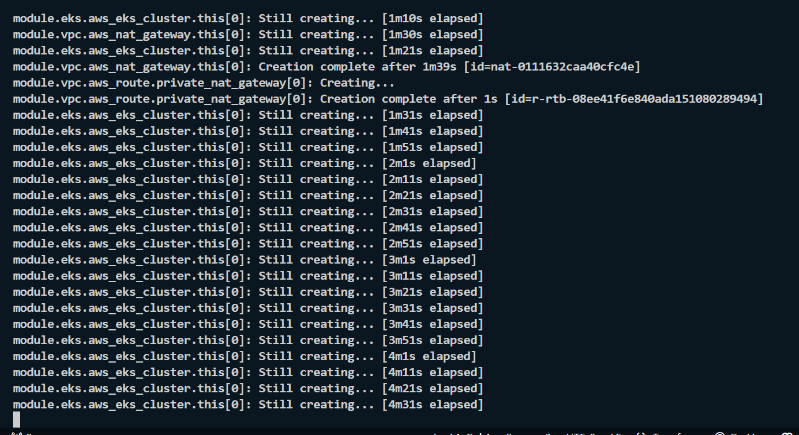
  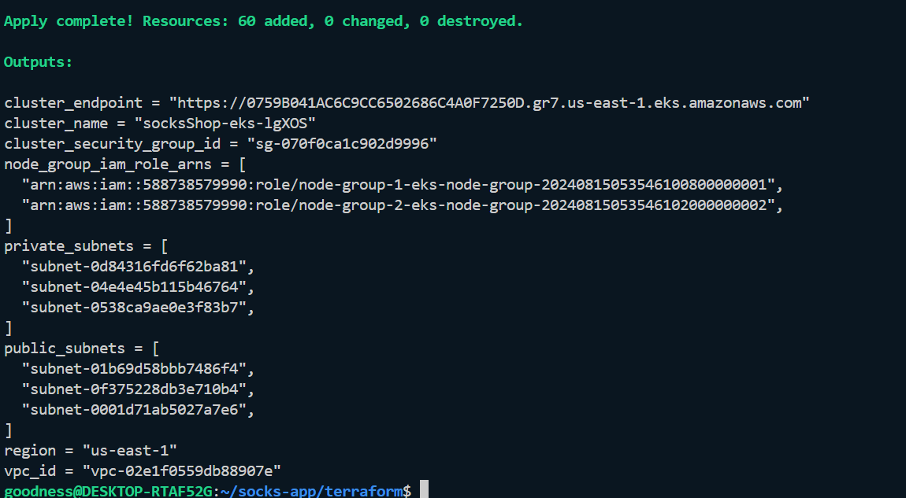
  
  you can check the cluster on your aws console
  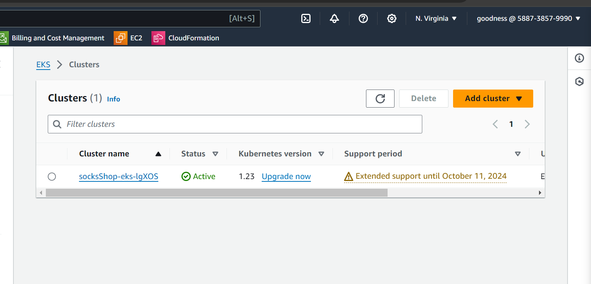


6. Configure your Kubernetes to connect to your Cluster
    Install and update kubectl to connect to your EKS cluster. You can use the following command to install kubectl:

    aws eks update-kubeconfig --name socksShop-eks-lgXOS --region us-east-1
  Once you run this command a new kubeconfig file will be created in your .kube folder.

  run the following command the command 
  ```
   kubectl apply -f deployment.yaml
  ```
  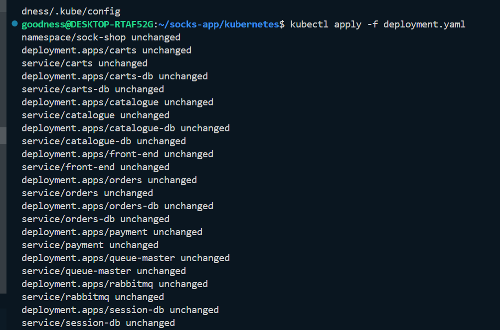
  
  You can use the kubeconfig file to access the Kubernetes cluster and deploy the Socks Shop application.
  check the status of your pods using the command
  ```
  kubectl get pods -n sock-shop 
  ```
  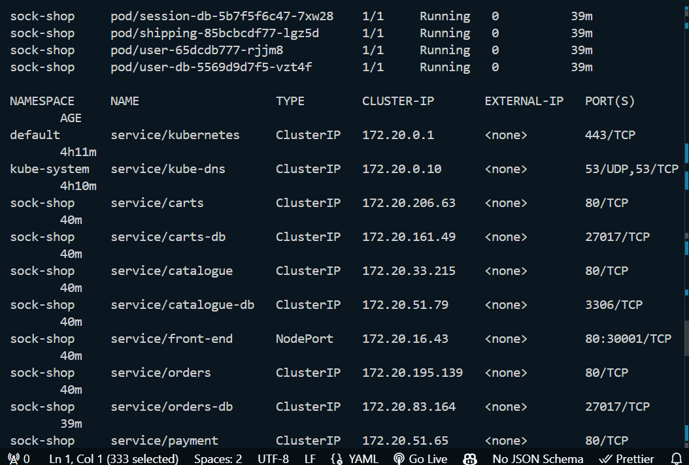
  
 After the pods are running, you can access the Socks Shop application through portforwarding running the following command:
 ```
  kubectl port-forward service/front-end -n sock-shop 8980:80
  ```
  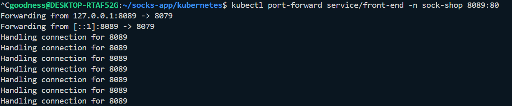

  you can also check it on your browser
  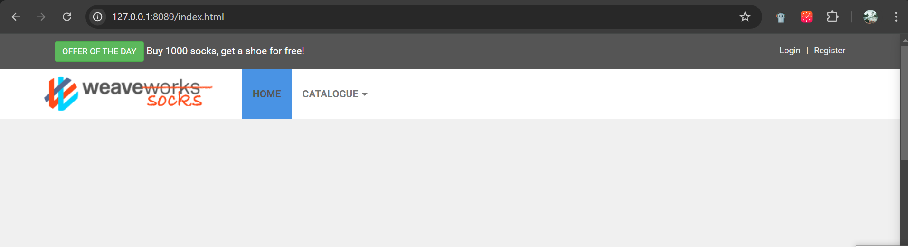

  seeing the front end of the application means the application is running successfully
  now you can wrap it to your domain name using ngix ingress controller
  ```
  helm repo add ingress-nginx https://kubernetes.github.io/ingress-nginx
  helm repo update
  ```
  after updating your helm repo, you can install the ingress controller using the following command
  ```
  helm install ingress-nginx ingress-nginx/ingress-nginx --namespace ingress-nginx --create-namespace
  ```
  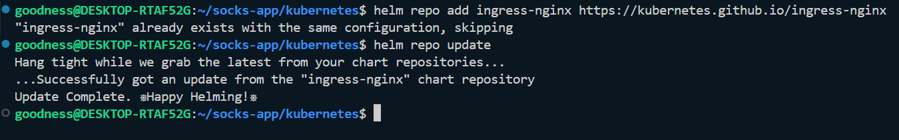
  
  you can check the domain dns or Elb ip of your ingress controller using the following command
  ```
  kubectl get services -o wide -n ingress-nginx
  ```
  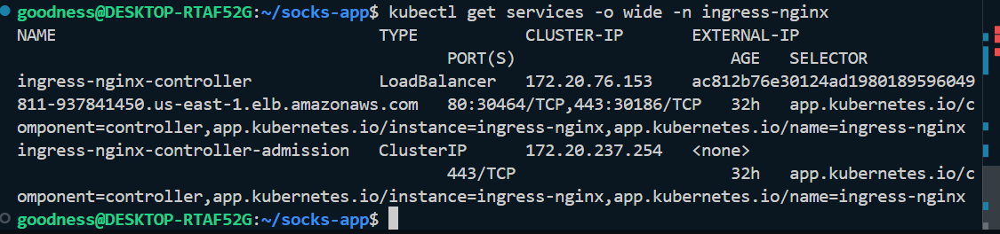
 
  once you have your load balancer ip you can access your app using the ip address
  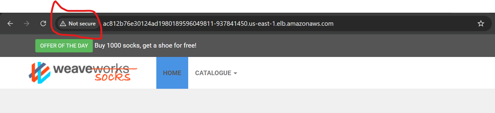

  you can see from the image above that the application is not secure, to make it secure you can use cert-manager to generate a certificate for your domain name
  
  you can proceed to encrypt your domain name using cert-manager
  
### Monitoring
Prometheus Setup
Overview
Prometheus is an open-source systems monitoring and alerting toolkit designed for reliability and scalability. In this project, Prometheus is used to collect and store metrics from various components of the application, enabling real-time monitoring and alerting.

Setup Instructions
Create a Namespace for Monitoring
It's a good practice to create a separate namespace for monitoring tools. This helps keep monitoring resources organized and isolated from other components.
```bash
kubectl apply -f prometeus-ns.yaml
```
Proceed to create your service, deployment and configmap for prometheus and then apply them using the following command
```bash
kubectl apply -f prometheus-configmap.yaml
kubectl apply -f prometheus-deployment.yaml
kubectl apply -f prometheus-service.yaml
```
check the status of your pods using the command
```bash
kubectl get pods -n monitoring
```
check the service
```bash
kubectl get svc -n monitoring
```


you can access the prometheus dashboard in your browser
```bash
http://a1928e67a07964a80a0b2d7d3cdb049d-705415564.us-east-1.elb.amazonaws.com:9090
```
check your targets


If you can access Prometheus and see the targets in the UI, then Prometheus is working correctly!

With Prometheus successfully set up, your Kubernetes cluster is now being monitored, and metrics are being collected. This is an essential part of maintaining the health and performance of your application.


### Grafana Setup
Overview
Grafana is an open-source platform for monitoring and observability. It provides powerful visualizations and dashboards to help you analyze and understand the metrics collected by Prometheus.

Setup Instructions
1. Create a mainfest for grafana deployment, service and configmap

2. To deploy Grafana and expose it via a LoadBalancer, apply the YAML files using the following commands:
```bash
kubectl apply -f grafana-configmap.yaml
kubectl apply -f grafana-deployment.yaml
```

3. Check the status of the Grafana pods using the following command:
```bash
kubectl get pods -n monitoring
kubectl get svc -n monitoring
```
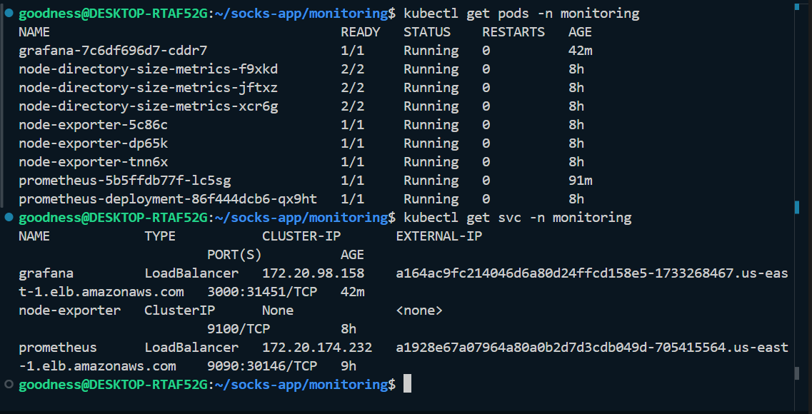

4. Access the Grafana dashboard in your browser using the LoadBalancer IP:
```bash
http://a164ac9fc214046d6a80d24ffcd158e5-1733268467.us-east-1.elb.amazonaws.com:3000
```
5. Log in to Grafana using the default credentials (username: admin, password: admin). You will be prompted to change the password after logging in for the first time.
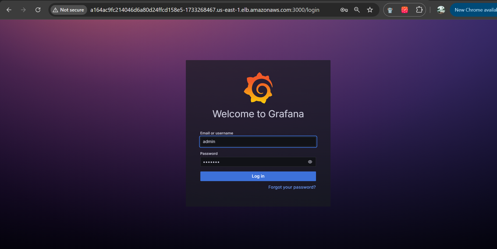

6.  Add Prometheus as a Data Source
Navigate to Configuration > Data Sources in Grafana.
- Click Add data source, and select Prometheus.
- Enter the following settings:
- URL: http://prometheus.monitoring.svc.cluster.local:9090
- Click Save & Test to confirm that Grafana can connect to Prometheus.

7. Create Dashboards
With Prometheus added as a data source, you can create custom dashboards or import pre-built ones to visualize the metrics.
To import a pre-built dashboard:
Go to Dashboards > Manage.
- Click Import and enter a dashboard ID from Grafana’s community (e.g., 1860 for Node Exporter Full).
- Load the dashboard and start monitoring your infrastructure.

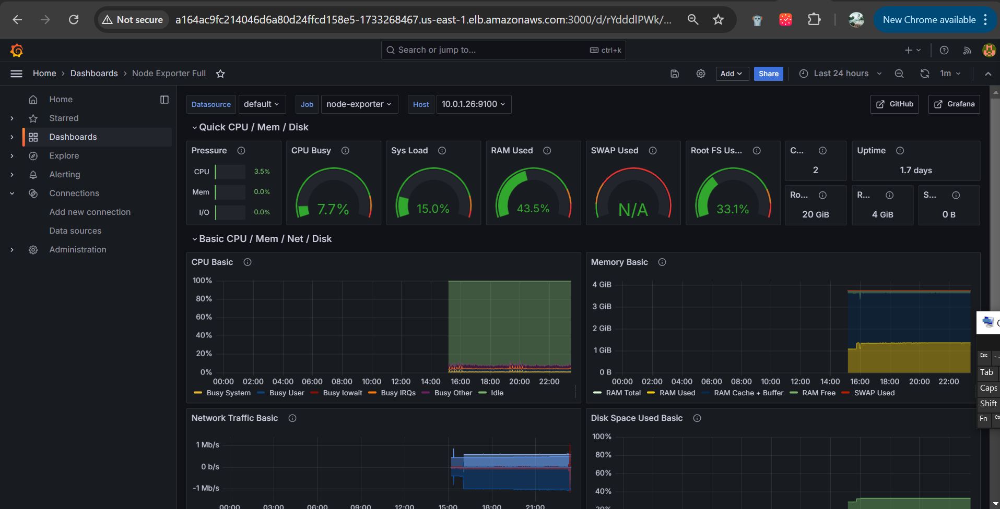

With Grafana set up, you now have a powerful tool for visualizing the metrics collected by Prometheus. You can create custom dashboards tailored to your specific monitoring needs, ensuring you have full visibility into your application and infrastructure.


### Logging Setup with Elasticsearch and Kibana
Overview
This guide covers the setup and configuration of Elasticsearch and Kibana for logging within a Kubernetes cluster. Elasticsearch stores and indexes log data, while Kibana provides visualization and querying capabilities.

Deployment
1. Create a Namespace for Logging
 
 Elasticsearch Deployment

- Create Elasticsearch Deployment and Service
- Apply the Elasticsearch deployment and service YAML files using the following commands:
```bash
kubectl apply -f elasticsearch-deployment.yaml
kubectl apply -f elasticsearch-service.yaml
```
2. Check your elasticsearch
```bash
kubectl get svc -n logging
```

3. Kibana Deployment
- Create Kibana Deployment and Service:
- Apply the Kibana deployment and service YAML files using the following commands:
```bash
kubectl apply -f kibana-deployment.yaml
kubectl apply -f kibana-service.yaml
```
- Check the status of the kibana service
```bash
kubectl get svc -n logging
```
4. Configuration
- Filebeat Configuration
Configure Filebeat to send logs to Elasticsearch and Kibana:

Edit the filebeat.yml configuration file:
```bash
filebeat.inputs:
- type: log
  paths:
    - /var/log/*.log

output.elasticsearch:
  hosts: ["http://<elasticsearch-external-ip>:9200"]
  username: "admin"
  password: "admin"

setup.kibana:
  host: "http://<kibana-external-ip>:5601"
```
- Apply Filebeat Setup:
```dash
sudo filebeat setup
```
5. Accessing Services
Elasticsearch: Access the Elasticsearch service at http://a0143940adb99498dba0a4a9616cfa7c-901989119.us-east-1.elb.amazonaws.com:9200.
Kibana: Access the Kibana service at http://a34d39927341840fcb7537df8678ceee-1834793744.us-east-1.elb.amazonaws.com:5601.


6. Troubleshooting

- Timeout Issues: Ensure Kibana is running and accessible. Increase the timeout settings in Filebeat if necessary.

- Access Errors: Check the logs for Elasticsearch and Kibana to diagnose and fix any issues.


## Conclusion
The successful deployment of the Socks Shop application using Kubernetes and Infrastructure as Code showcases the effectiveness of contemporary cloud-native technologies. This project illustrates how to create a resilient, scalable, and secure environment for microservices-based applications. It also serves as a detailed reference for deploying similar applications in production settings.
